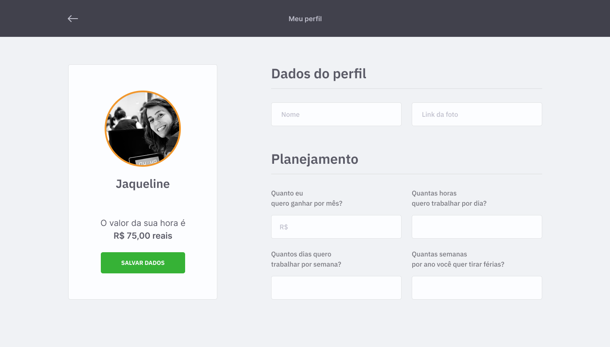
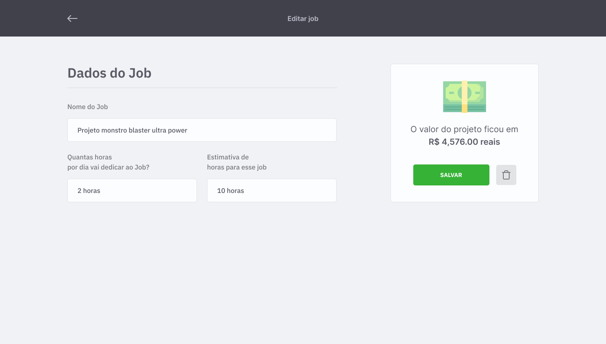
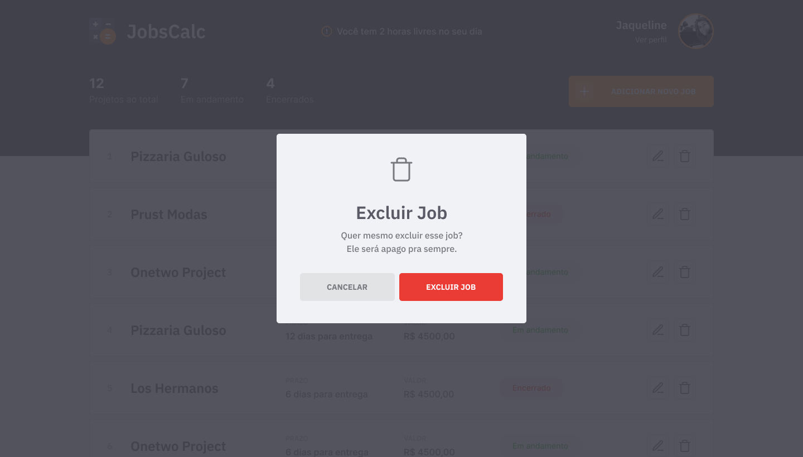

## [Leia esta página em português](https://github.com/ojeffpinheiro01/jobsCalc/blob/main/README-PT.md)

<h1 align="center">
   
</h1>


## Menu

[Overview](#book-overview)

[Technology](#rocket-technology)

[Preview](#eyes-preview)

[Layout](#art-layout)

[Running the project](#fire-running-the-project)

[How to contribute](#gear-how-to-contribute)

[Reach me](#mailbox-reach-me)

[Connect with me](#connect-with-me)

<br>

# :book: Overview
JobsCalc is an application that helps freelancers to have a previous salary, where it is possible to have a control of jobs and plan an hourly rate for those who are using
It is being developed during the Discover Marathon - offered by Rocketseat
<h4 align="center"> :construction: In development :construction:</h4>
 
---

# :rocket: Technology
This project was developed with the following technologies:
- HTML
- CSS
- JavaScript
- NodeJS
- EJS
- Express
- SQLite

---

# :eyes: Preview
## Web Screenshot
<div>
    
   
   
    
      
</div>

---

# :art: Layout
The Layout was developed by [Tiago Luchtenberg](https://www.instagram.com/tiagoluchtenberg/), and you can access it on [Figma](https://www.figma.com/file/s4fytPFbDiSkv4GPSfKaLE/Jobs-Planning)

---

# :fire: Running the project 
## Precondition 
You should have:
- NodeJS
- Package manager (NPM ou Yarn)

```bash
## Clone this repository :floppy_disk:
$ git clone https://github.com/ojeffpinheiro01/jobsCalc.git

## Access the project folder at the command prompt
$ cd jobsCalc

## Install the dependencies
$ yarn install
or
$ npm install

## Run 
### Run the application
$ yarn dev
or 
$ npm run dev

## The app is running on port 3000 - go to <http:// localhost: 3000> 
```
---

# :gear: How to contribute 
```bash
- Fork this repository;
- Create a branch with your feature: `git checkout -b my-feature`;
- Commit your changes: `git commit -m 'feat: My new feature'`;
- Push to your branch: `git push origin my-feature`.
```
---

# :mailbox: Reach me	
[](https://www.linkedin.com/in/jeferson-pinheiro/)
[](mailto:jefersonpinheirodesouza@gmail.com)

---

# Connect with me
<p align="center">
<a href="https://dev.to/ojeffoinheiro" target="blank"></a>
<a href="https://codepen.io/ojeffoinheiro" target="blank"></a>
<a href="https://linkedin.com/in/jeferson-pinheiro" target="blank"></a>
<a href="https://stackoverflow.com/ojeffpinheiro" target="blank"></a>
<a href="https://codesandbox.io/u/ojeffoinheiro" target="blank"></a>
<a href="https://app.rocketseat.com.br/me/jeferson-pinheiro-de-souza-1580117763" target="blank"></a>
</p>

---

>This project was developed with ❤️ by **[@Jéferson Pinheiro](https://github.com/ojeffpinheiro01/)**, with the instructor **[@MaykBrito](https://linkedin.com/in/maykbrito)**, during the **[Maratona Discover](https://maratonadiscover.rocketseat.com.br/inscricao/)** of **[Rocketseat](https://www.linkedin.com/school/rocketseat/about/)** 💜. <br> 
[Join our community!](https://discordapp.com/invite/gCRAFhc)<br>
If it helped you, give it ⭐, it will help me too 😉
